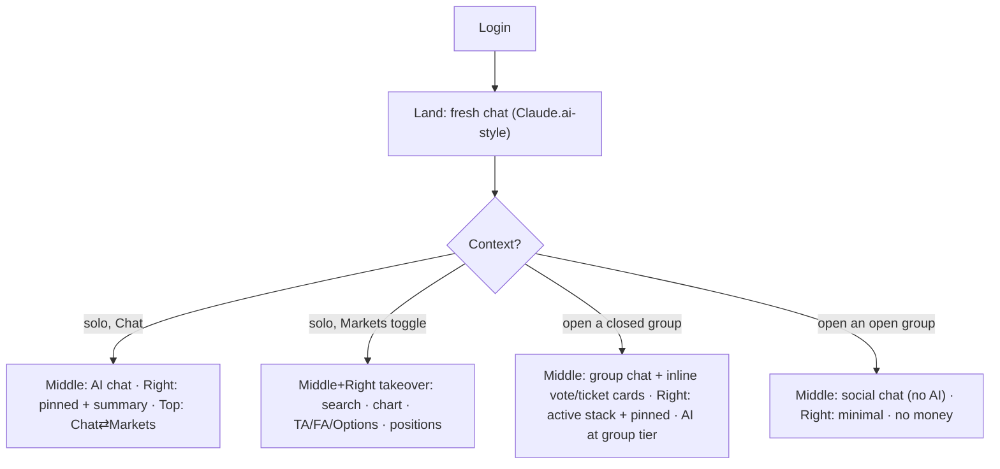
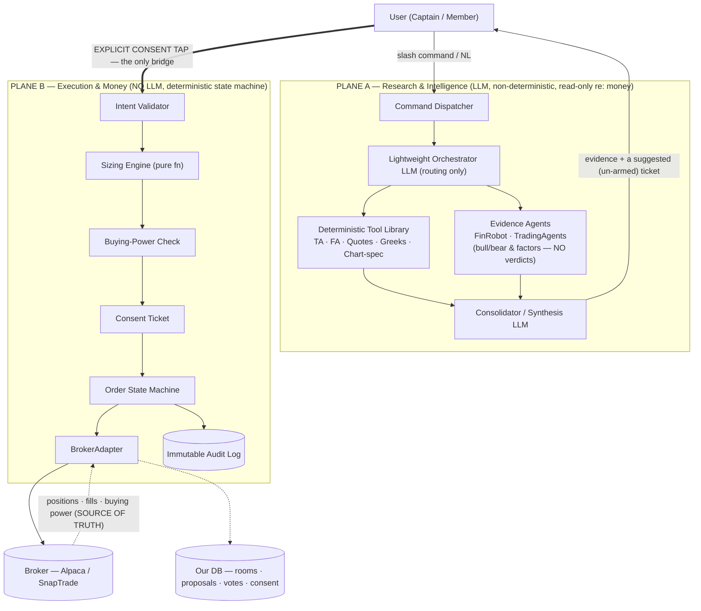
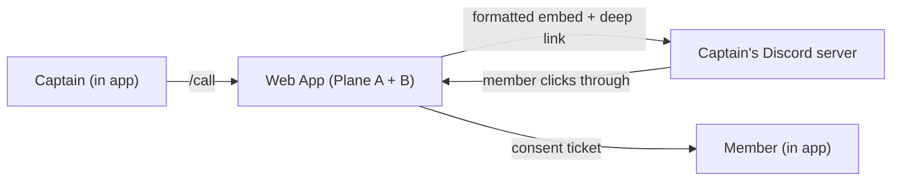
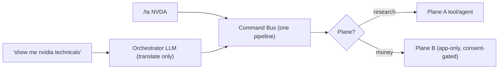
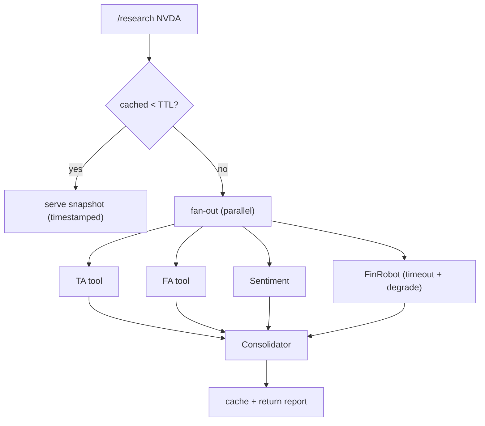
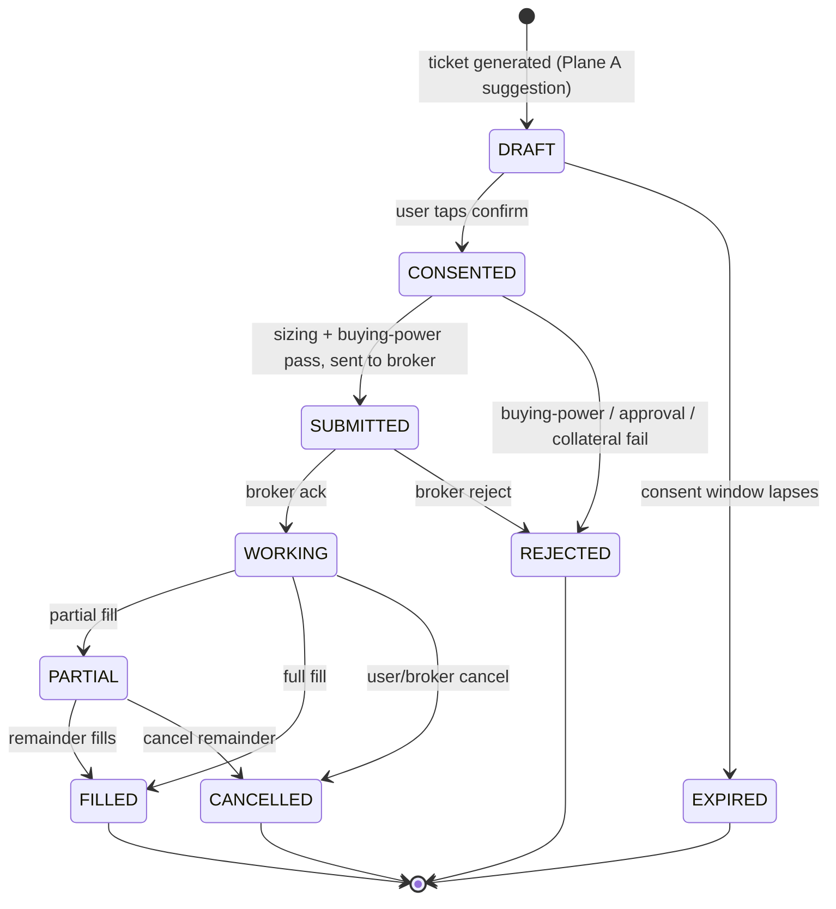
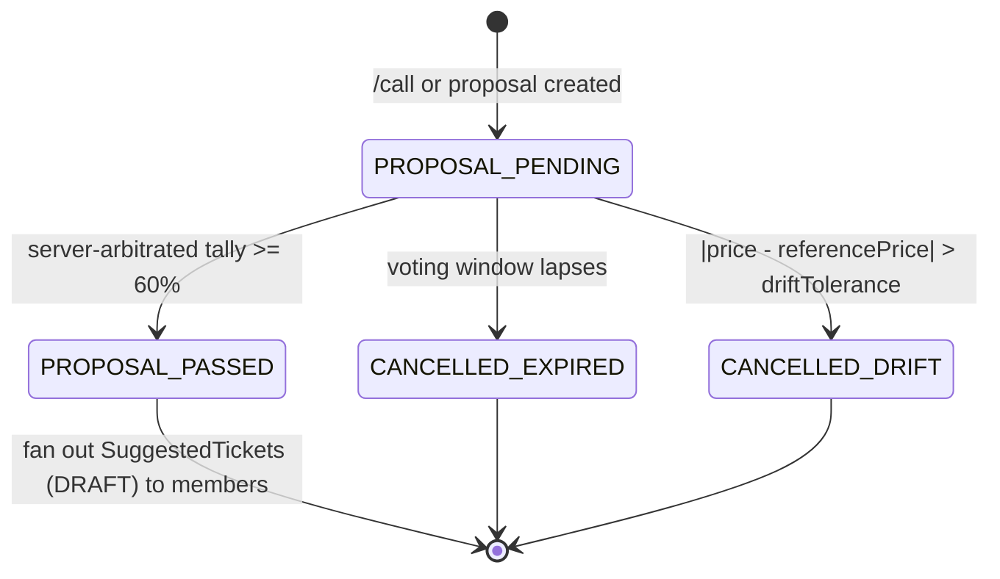
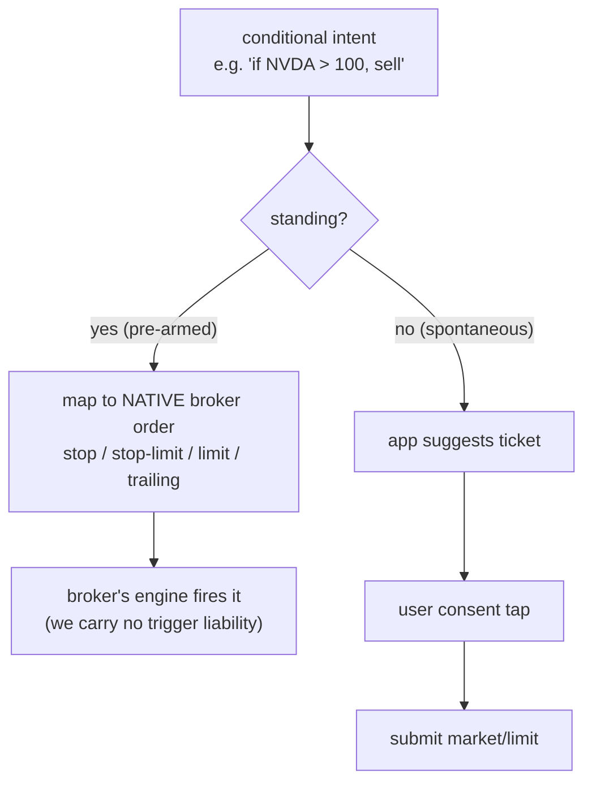

# Alpha-Signals.ai: Product Requirements & Specification Document (PRSD)

**Version:** 2.0 (Reconciled draft — Sections 1–3 aligned to the Section 0 contract and Sections 5–6)
**Status:** Internally consistent. ⚖️ Securities-counsel review of the flagged items still required before build.
**Goal:** A collaborative, AI-driven trading workspace where independent room leaders ("Captains") issue trade calls that members mirror in their own brokerage accounts through explicit, per-trade consent.

---

## 0. Settled decisions (the contract this spec is built on)

| # | Decision | Choice |
|---|---|---|
| 1 | Discretion | Platform **never** holds discretion. Every order is per-user and explicitly consented. |
| 2 | Cadence | Day / swing / position trading. Spontaneous scalping is **out** (consent latency kills it); fast-end coverage comes only from pre-armed native conditionals. |
| 3 | Broker (v1) | **Alpaca-first**, behind a `BrokerAdapter` interface. SnapTrade is Phase 2 (reach expansion). |
| 4 | Sizing | **% of a per-member, per-room committed allocation** (≥ Captain's minimum), recomputed at tap time against live buying power. |
| 5 | Options | **Single-leg only** (long calls/puts, covered calls, cash-secured puts). Limit orders only. |
| 6 | Conditionals | **Hybrid** — native broker order types (stop/limit/stop-limit/trailing) for standing orders; consent-tap for spontaneous. No custom trigger engine in v1. |
| 7 | Surfaces | Web app is the hero surface (Section 4). Discord is an **outbound broadcast + inbound deep-link** connector. Money commands are **app-only**. |
| 8 | Intelligence | LLM/agents surface **evidence**; humans render verdicts and place orders. Platform never says "BUY" in its own voice. |
| 9 | Determinism | The money path is **code**, not a low-temperature LLM. Analysis *numbers* are computed deterministically; LLMs only narrate. |

## 0.1 Reconciliation log (what changed in v1.6 and why)

This revision brings the older Sections 1–3 into line with the Section 0 contract and the Section 5–6 architecture.

**Safety-critical (the discretion firewall):**
- **Removed `auto_execute=true` (§3.1).** No path may fire an order without that member's explicit consent. Replaced by `resolution_mode`, which only decides *when consent tickets are issued*, never when money moves.
- **Rewrote the Emergency Exit Protocol (§3.3.D).** No automatic liquidation. `/panic` now broadcasts an alert and fans out one-tap close-tickets each member consents to.
- **Inserted the consent gate into the proposal lifecycle (§3.2).** A passed proposal fans out DRAFT consent tickets; it never routes straight to brokers.
- **Catch-Up Entry (§3.3.C) deferred** pending review; if kept, it is an explicit consent ticket, not an auto-mirror.

**Consistency:** v1 scope set to Captain-led (voting governance labeled Phase 2); broker list corrected to Alpaca-first / SnapTrade-Phase-2 (direct Robinhood removed); allocation cap reconciled (global cap with per-room sub-allocations); classifier placed *behind* deterministic command routing; financial events moved to the authoritative event channel; terminology unified on Captain/Member; drift tolerance aligned (0.75% equities / 5% options). Minimal matching fixes applied to §4.3–4.4 and three §4 class-name bugs; a fuller Section 4 UI pass remains outstanding.

---

## 1. Core Architecture & System Topology

Alpha-Signals.ai uses a two-plane, router-based topology: a fast intent router in front, with a non-deterministic **research plane (Plane A)** and a strictly deterministic **execution plane (Plane B)** behind it (see §5.1–5.2). The planes are isolated by capability — research services hold **no broker credentials** and cannot place orders.

* **LAYER 1 — THE CLASSIFIER JUDGE** (light inference, e.g. a small open model)
  - Handles **free-form natural language only**. Explicit slash commands bypass it and route deterministically via the command dispatcher (§5.5).
  - For NL trade intent it produces a *suggested command/ticket the user confirms* — it never routes anything straight to execution.

* **LAYER 2 — ROUTING DESTINATIONS**
  - `[DETERMINISTIC]` → deterministic tools / DB reads and push-based price alerts (native broker conditionals preferred over polling crons).
  - `[AGENTIC]` → Plane A research (FinRobot, TradingAgents) — surfaces **evidence, never verdicts** (§5.6).
  - `[TRADING]` → Plane B governance pipeline: pre-flight buying-power/approval check → **consent ticket** (plus, in Phase-2 voting rooms, a proposal/voting card). Always terminates in consent; never auto-executes.

* Financial state (`proposal.* / vote.* / order.* / fill.*`) travels on an **authoritative, ordered, replayable event channel**, separate from the best-effort LLM token stream (§6.9).

* **Frontend:** Next.js 15 (App Router), TypeScript, Tailwind, shadcn/ui; charts via TradingView Lightweight Charts.
* **AI UI:** Vercel AI SDK + AI Elements (streaming, structured tool-call blocks).
* **LLM gateway:** LiteLLM proxy over a managed provider; pin to current models and abstract behind the gateway so versions update without code change.
* **Backend:** Node.js runtime, WebSocket layer (Socket.io; Centrifugo for large-room fan-out), PostgreSQL ledger with an append-only event/outbox store.

---

## 2. Module Specifications

### 2.1 Authentication & Financial Access Control
* **Auth:** OAuth2 via NextAuth (Discord/Google providers) for session profiles.
* **Account session machine:** `UNCONNECTED → AUTHENTICATED → STRIPE_ACTIVE → BROKER_TUNNELED` (STRIPE_ACTIVE via Stripe Connect, Captain as merchant-of-record).
* **Squad Firewall (broker isolation):** users keep independent custody of their own capital — no pooled accounts, no joint-venture exposure. Broker tokens are encrypted at rest with AES-256-GCM. v1 broker: **Alpaca** (Broker API); **SnapTrade** multi-broker is **Phase 2**. (Direct Robinhood trading is not a v1 integration.)
* **Allocation caps:** at `BROKER_TUNNELED` the user sets a **global per-user capital cap**; the engine is blinded to equity beyond it. Within that global cap, each room carries a **per-room committed allocation** (≥ the Captain's minimum), and per-room allocations must sum within the global cap — bounding cross-room leverage (§6.5).

### 2.2 Hybrid Execution Engine (the "Classifier Judge")
Free-form input is classified by a lightweight model to control token spend; **explicit slash commands skip the classifier and route deterministically.** For trade intent the classifier yields a *suggested ticket the user must confirm* — it cannot route to execution.

Example NL classification output:
```json
{
  "prompt": "should I add some NVDA here?",
  "intent": "TRADING",
  "ticker": "NVDA",
  "confidence_score": 0.96,
  "suggested_command": "/buy NVDA",
  "requires_consent_ticket": true
}
```

| Intent | Destination | Action | Compute |
| :--- | :--- | :--- | :--- |
| **DETERMINISTIC** | DB / tool ops | Deterministic lookups, push price alerts. No LLM. | ~$0.00 |
| **AGENTIC** | Plane A (FinRobot / TradingAgents) | Multi-agent **evidence** generation (bull/bear, equity sheets). No verdicts, no auto-trading, no backtests in v1. | Moderate |
| **TRADING** | Plane B governance | Pre-flight buying-power/approval check → **consent ticket** (Phase-2 rooms also render a voting card). Terminates in consent. | Low |

### 2.3 Role-Based Access Control (RBAC) Matrix
Roles use the Captain/Member vocabulary unified with §5–6 (older structural names in parentheses):

| Role | Maps to | Vote (Phase-2 rooms) | Issue /call or /propose | Request AI analysis | Pin to panels | Mutate room rules |
| :--- | :--- | :---: | :---: | :---: | :---: | :---: |
| **Captain** | Room owner (Strategist) | Yes | Yes | Yes | Yes | Yes |
| **Co-Captain** | Co-admin (Signal Provider) | Yes | Yes | Yes | Yes | No |
| **Member** | Standard member (Validator) | Yes | No | Yes | Yes | No |
| **Observer** | Guest | No | No | No | No | No |

Voting columns apply only to Phase-2 voting ("Syndicate") rooms. In v1 Captain-led rooms there is no vote — the Captain calls, and members consent to tickets.

---

## 3. The Trade Engine & Multi-Account Lifecycle

v1 ships the **Captain-led** flow: a Captain's `/call` fans out consent tickets to members. The democratic voting governance below is built but **toggled on per room as a Phase-2 feature** ("Syndicate").

### 3.1 Governance Parameters (Phase-2 voting rooms)
The Captain configures consensus parameters per room:
* `majority_threshold` (float): share of voting members required to pass (default `0.60`).
* `voting_window_seconds` (int): proposal lifespan before expiry (default `600`).
* `quorum_count` (int): minimum votes for a valid consensus (default `3`).
* `resolution_mode` (enum: `on_threshold` | `on_window_close`): **when consent tickets are fanned out** — the moment the threshold is crossed, or when the timer ends. *(Replaces the former `auto_execute` flag. There is no path that fires an order without each member's consent.)*

### 3.2 Proposal States & Runtime Loop
Every `/call` (or, in voting rooms, `/propose`) follows this path. Note the **consent gate** before anything reaches a broker:

```
[PROPOSAL_PENDING] → (Captain call / consensus cleared) → [PROPOSAL_PASSED]
     → [FAN_OUT_TICKETS]  (one DRAFT consent ticket per member)
     → per member: [CONSENTED] → [SUBMITTED] → [WORKING] → [FILLED]
   ├─ (timer hits 0 without threshold) → [CANCELLED_EXPIRED]
   └─ (price drifts beyond tolerance)  → [CANCELLED_DRIFT]
```

A passed proposal **never** routes straight to brokers; it issues tickets that members arm individually. The server is the sole arbiter of the tally (§6.4); clients render, they do not compute the outcome.

### 3.3 Execution Edge Cases & Circuit Breakers

#### A. Price-Drift Guardrail
On `PROPOSAL_PASSED` the backend captures the live Alpaca quote. If price has drifted beyond tolerance from the proposal reference, the sequence aborts to `CANCELLED_DRIFT` with a warning card. Tolerance is per-room configurable; defaults **0.75% (equities) / 5% (options)** — options need the wider band.

#### B. Partial Fill & Broker-Fault Isolation
After members consent, orders dispatch as independent async per-account workers. A failed account (bad token, insufficient buying power) transitions to `EXECUTION_FAILED` and receives a private alert; valid accounts proceed without stalling the group.

#### C. Catch-Up Entry Window — ⚖️ deferred pending review
If kept, a late member sees a one-tap **consent ticket** (not an auto-mirror) while price stays within the drift corridor, with an explicit slippage disclaimer. Deferred from v1 because it encourages chasing entries at worse prices and was flagged as legally sensitive.

#### D. Emergency Exit Protocol (`/panic [TICKER]`) — rewritten
A Captain or Co-Captain can broadcast a high-priority exit signal. This does **not** auto-liquidate anyone.
* Renders a prominent red alert across all online members' UIs.
* Fans out a pre-filled, one-tap **close-ticket** to each member holding the position; each member consents to close their own position.
* The Captain closes their own position via their own consent. No automatic parallel liquidation; no reduced-threshold auto-fire.

---

## 4. UI/UX — Information Architecture, Screens & Components (v2.1)

> **Replaces** the prior 4.1–4.4. Version 2.0. Consolidates the design review into a buildable spec: the two-gravity IA, the context-aware shell, the solo and group screens with their states, the monetization surfaces, and the component inventory. Where this conflicts with the old 4.3–4.4 event descriptions, this section governs. Engineering and product only; ⚖️ LEGAL-REVIEW items remain per §0.

---

### 4.0 First principles

1. **Two gravities.** The product has two centers of gravity that must never blur: the **Group** plane (shared, broadcast, observational) and the **Personal** plane (private — the *only* place money happens). The **consent ticket is the membrane** between them; a group call becomes a personal action only by an explicit tap. This is the Plane A / Plane B split (§5) made spatial.
2. **One context-aware shell, four states.** The same chrome (left rail · top bar · middle · right) behaves differently by context: *Solo · Chat*, *Solo · Markets*, *Closed group*, *Open group*.
3. **Surfaces.** Web app is the hero. **Markets is solo-only.** **Groups are chat-only** (no analysis panels — research appears as inline chat cards). Discord is an outbound-broadcast + inbound-deep-link connector, never an execution surface.
4. **Contextual entitlement.** AI capability resolves against the *session context*, server-side: solo runs at the user's tier; a group runs at the group's effective tier (Captain-set minimum, or the lowest member's tier if unset). The trade loop only ever fires from a natively-run, entitlement-checked action — so premium value is un-leakable (§4.5).
5. **Never paywall safety or own-money.** Positions, P&L, buying power, order status, and the consent flow are free at every tier. Gating is for *intelligence and convenience* only.

---

### 4.1 Information architecture: the context-aware shell



**Region behavior matrix:**

| Region | Solo · Chat | Solo · Markets | Closed group | Open group |
|---|---|---|---|---|
| **Left rail** | chats + groups | chats + groups | chats + groups | chats + groups |
| **Top bar** | `Chat ⇄ Markets`, tier badge, user | toggle (Markets active) | group name + members; **no Markets** | group name; **no Markets** |
| **Middle** | AI research chat | *takeover:* search · price · tools · positions/orders | group chat + inline vote/ticket cards | social chat (no AI) |
| **Right** | pinned cards + chat summary | *taken over by Markets* | **active votes/tickets stack** + pinned | minimal (members / pinned) |
| **AI** | full, at user's tier | full, at user's tier | at **group** tier | none |
| **Money** | own account | own account (dashboard lives here) | committed funds; votes → consent | none |

---

**Mobile adaptation.** On phones the three-panel shell collapses to a single column with native patterns: the **left rail → a drawer** (hamburger), the **right panel** (pinned cards / active-votes stack) **→ a bottom sheet**, top-level navigation **→ a bottom tab bar** (Chat · Markets · Groups · Account), and the Markets takeover **→ a single stacked column**. `ConsentTicket` and `VoteCard` present as **bottom sheets** with a touch hold-to-confirm. Because members act on calls and `/panic` from their phones, mobile gets **push notifications** (PWA web push) for calls, panics, and passed votes.

### 4.2 Design system (carried forward, reconciled)

The dark, institutional-terminal aesthetic from the prior 4.2 carries forward as **semantic tokens** (not raw utility classes): base/surface/border layers, bullish=success, bearish=danger, AI/intelligence=info, mono type for all numbers/tickers/prices, sans for chrome. The 3-panel resizable layout and keybindings (`Cmd/Ctrl+B` left, `Cmd/Ctrl+J` right) remain.

New, binding rules added by this revision:
- **Facts vs. model views are visually distinct everywhere.** Computed/deterministic data (RSI, P/E, greeks) renders in a neutral zone; LLM/agent interpretation renders in a labeled "model view — evidence, not advice" zone. Never blended.
- **Never blur/tease the user's own data** — only premium *analysis* gets a gated treatment (§4.5).
- **Mobile-first, not desktop-with-breakpoints.** The whole shell adapts: left rail → drawer, right panel → bottom sheet, nav → bottom tab bar, Markets → stacked column. `ConsentTicket`/`VoteCard` are bottom sheets with touch hold-to-confirm; no hover-only affordances; touch targets ≥ 44px. (The prior `h-screen w-screen` desktop-only assumption is dropped.)
- **Status uses color + icon + text** (never color alone); WCAG AA contrast; full keyboard path for voting and consent.

---

### 4.3 Screen specs

#### 4.3.1 Solo · Fresh chat landing  *(the login destination)*
- **Purpose:** Claude.ai-style entry; each chat is a way to find stocks/options to trade.
- **Regions:** left rail (New chat, Recent, Groups); slim top bar (`Chat ⇄ Markets`, tier badge, user icon → account); middle = centered greeting + input ("Ask anything, or `/` for commands") + example chips (`/research NVDA`, `/ta`, "find option ideas", "scan watchlist"); right = empty.
- **States:** **empty/first-run** is the default — greeting + input + a model line ("Powered by the Strong model · upgrade for the frontier model"). Right panel shows an empty hint ("pinned research and summary appear here").

#### 4.3.2 Solo · Active chat
- **Purpose:** research loop with persistent reference.
- **Middle:** message feed; assistant research output renders as a **`ResearchCard`** (facts zone + model-view zone) with actions **Pin**, **→ Suggest ticket**, **Chart**.
- **Right:** **pinned cards** (kept in view) + a **running chat summary**.
- **States:** loading (per-tool skeleton) · partial (an agent timed out, facts still shown) · cached snapshot (timestamped) · error. `→ Suggest ticket` is the only path to a trade and produces a `ConsentTicket`.

#### 4.3.3 Solo · Markets takeover  *(solo-only; replaces middle + right)*
- **Purpose:** finance.google-style terminal + the personal portfolio dashboard.
- **Layout:** ticker search → ticker header (price, day change, timeframe tabs) → chart (Lightweight Charts, indicator toggles) → **Technicals** panel → **Fundamentals** + **Options (single-leg)** panels → **Your positions & orders** table (holdings, P&L, open/armed orders).
- **States:** no-ticker (search prompt + watchlist/positions) · loading · equity-only (no options panel) · delayed-data badge for Free tier.

#### 4.3.4 Closed group · chat  *(the USP)*
- **Purpose:** democratic, AI-enabled, committed-funds group. Chat-only surface.
- **Middle:** group chat; proposals render as **inline `VoteCard`s** (gauge against threshold, timer, upvote/pass); research as inline cards **at the group's tier**.
- **Right:** **Active stack** — every open proposal/ticket at a glance, supporting **multiple simultaneous votes** (e.g., NVDA 60% 3:12, TSLA 35% 1:40, plus a passed AAPL `ConsentTicket` "hold to confirm"); below it, pinned items.
- **Rules:** tally is server-arbitrated; a **passed proposal fans out consent tickets — it never auto-trades**; `/panic` broadcasts a close-ticket, never liquidates.
- **States:** first-join (teach the room's rules + show the first call) · live · drift-warning · expired · locked (gated AI).

#### 4.3.5 Open group · chat
- **Purpose:** social discovery / funnel toward closed groups. Deliberately minimal.
- **Middle:** social chat, **no AI**, no research commands, no execution (members can share views as plain text). Right: minimal (members, pinned messages). No money, no Markets toggle.

---

#### 4.3.6 Auth / login
- **Purpose:** authenticate and enter the app.
- **Providers:** Discord + Google (OAuth via NextAuth) + email magic-link. The Discord grant also seeds the future broadcast/deep-link connector.
- **Flow:** on success → land in a fresh solo chat on **Free**; broker-link and subscription are triggered *contextually* (when trading or joining a group), per the `UNCONNECTED → AUTHENTICATED → STRIPE_ACTIVE → BROKER_TUNNELED` session machine (§2.1).
- **States:** default · authenticating · error · provider-denied.

#### 4.3.7 Subscription plans
- **Purpose:** tier comparison + upgrade surface; also the target of `GatedSection` and the member join gate.
- **Content:** Free / Pro / Premium columns per the §4.5 matrix; placeholder prices $0 / $19 / $49; Stripe checkout.
- **Variants:** standalone pricing page · group-context banner ("this group requires Pro") · upgrade-sheet (modal) launched from a gated state.
- **States:** current-plan marked · upgrading · payment-error.

#### 4.3.8 Account page
- **Purpose:** manage subscription, brokerage, group memberships, and security.
- **Sections:** Profile (auth provider) · Subscription (tier, renewal, **usage meters** tied to quota, manage billing via Stripe) · Brokerage (linked broker, buying power, manage/disconnect) · Groups (memberships with role + committed funds) · Security (sessions, sign out).
- **Never paywalled:** own positions, buying power, and the consent flow stay accessible at every tier.

### 4.4 Real-time interaction & generative-UI lifecycle (reconciled)

The streaming → consensus → settlement lifecycle from the prior 4.3 carries forward, corrected:
- **Lifecycle A — streaming:** skeleton loader while a tool/agent runs; the model's narration may stream on a best-effort channel.
- **Lifecycle B — active:** the card resolves to a **`ConsentTicket`** (solo / Captain-led) or a **`VoteCard`** (voting rooms). The vote gauge renders the **server's `proposal_resolved`** event; it does **not** compute the outcome client-side.
- **Lifecycle C — locked/resolved:** card seals to an immutable status (executed / expired / drift-cancelled). (Renamed from "settlement" to avoid confusion with T+1 settlement.)

**Financial state** (`proposal.* / vote.* / order.* / fill.*`) hydrates from the **authoritative, ordered, replayable event channel** — never the LLM token stream. Multiple concurrent proposals are supported; the right-panel Active stack is the canonical multi-vote view. (Replaces the prior 4.4 event matrix; the old `position_liquidated` / auto-append rows are removed per §3/§6.)

---

### 4.5 Monetization surfaces

**Tiers (placeholders):**

| | Free | Pro | Premium |
|---|---|---|---|
| Research LLM | fast/small | strong | **frontier** |
| `/ta` `/fa` `/q` | daily cap | unlimited | unlimited |
| `/research` (multi-agent) | 3 / mo | daily cap | high / uncapped |
| Market data | delayed 15-min | real-time | + extended hours |
| Options analytics | basic | full greeks/IV/POP | + probability cone, what-if |
| Trading (own account) | — research only | yes | yes |
| Closed groups | preview only (time-limited) | join + create | join + create |
| Background watchlist alerts | — | a few | many + priority |
| Own positions / P&L / safety | **free** | **free** | **free** |

**Gating principles:** gate on cost+value drivers (frontier LLM, deep `/research`, real-time data, volume); the *facts are identical across tiers* (computed by tools) — higher tiers buy sharper synthesis, not different numbers; Free must be a real taste (good model, a few full `/research`) so it converts.

**`GatedSection` component — four modes:**
- **Tier-locked** (Free / above-plan): blurred teaser + "Upgrade to [tier] to unlock" + one-line value.
- **Quota-exhausted** (paid, out of runs): blurred teaser + meter (`3/3`) + **reset date** + "Upgrade for unlimited" + "remind me at reset". Always offer the wait path — never coerce.
- **Group-locked** (inside a group below the needed tier): "This group runs on [tier] AI — raise the group's minimum to unlock for everyone."
- **Healthy:** proactive quota chip ("2 deep-research left") near the action so exhaustion is never a surprise.

**The group-tier multiplier:** because a group's AI runs at its minimum tier, one upgrade decision (Captain raises the floor) lifts the whole group. The group-settings UI must surface this as the primary upsell.

**Leakage defense (a Premium member pasting research into a lower-tier group):** not fully preventable (humans can copy text), and not worth DRM. Instead: (1) **contextual entitlement** — `/research` in a Pro group runs at Pro, so premium can't be generated in-group; (2) **premium is a live capability, not a text artifact** — pasted output is plain text, stale, non-interactive, and **cannot become a pinned card or a proposal/consent ticket**, so the money loop is un-leakable; (3) **soft attribution** ("generated with Premium · {time}") as a mild deterrent; (4) make the legit **group upgrade one tap**. No paste-detection / watermark-scanning.

---

### 4.6 Component inventory

**Shell / chrome:** `AppShell` (4 layout states), `LeftRail` (chats + groups + New chat), `TopBar` (`ChatMarketsToggle`, `TierBadge`, user menu), `ModeToggle`, `CommandBar` (slash + NL → dispatcher), `RoleBadge` (Captain / Co-Captain / Member / Observer), `BrokerLinkFlow`, `EntitlementGate` (server-enforced).

**Group (chat-only):** `GroupChatFeed`, `VoteCard` (gauge · timer · upvote/pass; states: pending/passed/cancelled-expired/cancelled-drift/locked), `ActiveStack` (multiple concurrent votes/tickets), `PanicBanner` (broadcast → close-tickets, never liquidate), `FirstJoinEmptyState`.

**Personal / Cockpit:** **`ConsentTicket`** *(the membrane — the single most important component)* — states: `draft · computing · insufficient-funds · drift-blocked · holding-to-confirm · submitting · filled · partial · rejected · expired`. `PositionsTable` / `PositionRow` (broker-confirmed; equity + option variants; assigned/expired option states), `BuyingPowerMeter`, `AllocationBar` (global cap + per-room committed), `OrdersPanel` (working / armed / pending).

**Analysis (solo Markets + inline cards):** `TickerSearch`, `PriceChart` (Lightweight Charts), `FactStrip` (deterministic), `ModelViewStrip` (labeled, disclaimed), `OptionsChain` (focused view, level-gated rows), `ResearchCard` (Pin / → ticket / Chart), `TicketBuilder`.

**Monetization:** **`GatedSection`** (tier-locked / quota-exhausted / group-locked / healthy), `QuotaMeter`, `UpgradeSheet`, `GroupTierSettings` (the multiplier upsell).

---

**Account / auth:** `AuthScreen` (Discord / Google / email) · `PlansPricing` + `UpgradeSheet` (standalone + group-context + modal) · `AccountPage` (Profile / Subscription / Brokerage / Groups / Security) · `UsageMeters` · `BillingPanel` (Stripe).

### 4.7 Cross-cutting requirements
- **Mobile-first:** the entire shell adapts (drawer / bottom-nav / bottom-sheets), `ConsentTicket` & `VoteCard` are touch bottom sheets, and **PWA + web push** delivers calls, panics, and passed votes when the app is backgrounded.
- **Accessibility:** color+icon+text status, keyboard path for vote/consent, WCAG AA, ARIA on live regions (vote gauges, fills).
- **Never paywall** own-money views or the consent/safety flow (§4.0.5).
- **Empty/error states are first-class:** first-run room, broker-not-linked (every money component degrades to "connect your broker"), approval-locked option rows (shown disabled with a reason, never hidden).

## 5.1 The two-plane model

The system is split into two planes with fundamentally different guarantees. **Plane A** is allowed to be smart and fuzzy; **Plane B** is required to be dumb and exact. The only bridge between them is an explicit human consent action.



**Why this shape:** an LLM that hallucinates a ticker or a quantity is catastrophic in the money path and merely annoying in the research path. Keeping them physically separate means the worst Plane A can do is render a bad *suggestion* — which a human then has to consciously consent to before anything real happens.

### 5.2 The plane boundary & capability isolation

The boundary is **one-way and structured**:

1. Plane A may produce a **suggested ticket** — a fully-specified but **un-armed** order proposal (symbol, side, size rule, order type). It is data, not an action.
2. The only thing that crosses into Plane B is an **explicit user consent event** referencing that ticket.
3. Once in Plane B, **no LLM is ever in the loop again**.

This is enforced architecturally, not by convention:

- **Capability isolation.** Plane A services hold **no broker credentials and no trade scopes**. They physically cannot call `placeOrder`, even under prompt injection. Trade credentials live only in Plane B execution services.
- **Determinism ≠ temperature 0.** "Deterministic" means *literal code* — pure functions over typed inputs, unit-tested, versioned. LLM output drifts across model/provider versions even at temperature 0, and we do not control vendor checkpoint changes. Anything whose result must be reproducible and trusted (sizing, tally, buying-power, risk checks) is code.

### 5.3 Source of truth

Two authorities, cleanly divided, with a reconciliation loop between them:

| Domain | Source of truth | Notes |
|---|---|---|
| Positions, fills, buying power, order status, option approval level | **The broker** | We never assume our DB knows the real position. We read it. |
| Rooms, rule sets, proposals, votes, consent records, suggested tickets | **Our DB** | Append-only where it matters (consent, audit). |

**Reconciliation:** Plane B treats every broker response as authoritative and writes a local mirror for display only. A periodic reconciliation job compares our mirror against broker state and flags drift. The UI's position panel (Section 4.4 "Squad Trades") renders the *broker-confirmed* state, never an optimistic local guess, for anything involving real money.

### 5.4 Surfaces

The **web app is the system of record and the only execution surface.** Discord is a connector, not a host.



- **Outbound:** a Captain's `/call`, research summaries, and broadcasts post to their linked Discord channel as formatted messages with deep links back into the app.
- **Inbound:** followers click the deep link and land on the consent ticket **inside the app**, where buying power, sizing, and disclosures are shown.
- **Hard rule:** anything that creates or arms an order is **app-only**. Discord never executes money.

### 5.5 The command dispatcher

A single dispatcher service serves **both** the web app and the Discord bot, so command grammar and behavior are identical and implemented once. Natural language is treated as a **fuzzy front-end**: the orchestrator LLM's only job is to translate free-form text into a command + args, which then runs the exact same deterministic pipeline as a typed command.



**Design rules:**
- Research commands → Plane A (deterministic tools + optional synthesis).
- Money commands → Plane B, app-only, always return a consent ticket; they never auto-fire.
- For money intent, **prefer explicit commands over NL translation** — `/buy NVDA 5%` shrinks the hallucination surface at the most dangerous point. NL is reserved primarily for research.

**Command namespace** (short, terminal-style; `tkr` = ticker):

*Research & analysis — Plane A; one-liner free, deep report is a paywall lever*

| Cmd | Does | Scope |
|---|---|---|
| `/ta <tkr>` | Technical analysis (pandas-ta) | All |
| `/fa <tkr>` | Fundamentals (P/E, EPS, growth, margins) | All |
| `/q <tkr>` | Fast quote | All |
| `/chart <tkr> [tf]` | Chart with default indicators | All |
| `/opt <tkr>` | Options snapshot, IV, ATM greeks (py_vollib) | All |
| `/earn <tkr>` | Earnings date + surprise history | All |
| `/news <tkr>` | Headlines, sourced + timestamped | All |
| `/sent <tkr>` | Sentiment **input**, labeled derived/estimated | All |
| `/research <tkr>` | Composite: FinRobot + TA + FA + sentiment, synthesized (see §5.6) | All |

*Trade & execution — Plane B, consent-gated, **app-only***

| Cmd | Does | Scope |
|---|---|---|
| `/call <tkr> <dir> [notes]` | Captain issues a call → fans out consent tickets + broadcasts to Discord | Captain |
| `/buy <tkr> [size]` | Propose buy → consent ticket | Member |
| `/sell <tkr> [size]` | Propose sell → consent ticket | Member |
| `/close <tkr>` | Propose closing a position → consent ticket | Member |
| `/stop <tkr> <px>` | Arm a native broker stop (broker-fired) | Member |
| `/limit <tkr> <px>` | Arm a native limit order | Member |
| `/panic` | Captain broadcast "I'm exiting" → fans out close-tickets (each consented) | Captain |
| `/cancel <id>` | Cancel a pending/armed order | Member |

*Portfolio & account — Plane B reads, app-only*

| Cmd | Does | Scope |
|---|---|---|
| `/pos` | Positions (broker = truth) | Member |
| `/bp` | Buying power / committed-fund availability | Member |
| `/pnl` | P/L summary | Member |
| `/orders` | Open / pending / armed orders | Member |
| `/link` | Connect or manage brokerage connection | Member |

*Room, social & monetization*

| Cmd | Does | Scope |
|---|---|---|
| `/rules` | Show room rule set (sizing %, min committed fund) | All |
| `/join <room>` / `/leave <room>` | Membership (join triggers rule-set acceptance) | Member |
| `/config` | Set room rules — sizing, min fund, asset classes | Captain |
| `/members` | Roster | Captain |
| `/stats` | Room performance, members, revenue | Captain |
| `/sub` | Manage subscription / billing | Member |
| `/broadcast <msg>` | Push a non-trade message to linked Discord | Captain |

*Utility*

| Cmd | Does | Scope |
|---|---|---|
| `/help [cmd]` | Command registry / help | All |
| `/watch <tkr>` | Add to watchlist | All |
| `/alert <tkr> <cond>` | Price alert — **notification only, not an order** | All |
| `/settings` | Preferences | All |

> `/alert` and `/stop` look alike but live on opposite planes — one pings you, one arms real money. Keep them visually unmistakable in the UI.

### 5.6 Plane A — Research & Intelligence

**Pattern:** a lightweight orchestrator routes the request; **deterministic tools compute all numbers**; an optional synthesis LLM turns the structured outputs into readable prose and **cites** them. The LLM never computes a number it then presents as a fact.

- **Deterministic tools** (the numbers users trust): `/ta` → pandas-ta; `/fa` → data provider; `/opt` greeks → py_vollib; quotes → broker/data API. Reproducible, code, versioned.
- **Evidence agents** (interpretation, not verdicts): FinRobot (deep equity-research generation) and TradingAgents (bull-vs-bear researcher debate). These surface *the case for and against*, **not** a directional call.
- **Synthesis:** the consolidator merges tool outputs + evidence into a report. **Computed facts and model views are rendered in visually distinct zones** so a measured number (RSI 71) is never confused with a model interpretation.

**`/research <tkr>` — the one command that earns real orchestration:**



- **Cache & share per ticker.** `/research` is the most expensive command (multiple agents + data calls, tens of seconds). Run once per ticker, cache with a short TTL, and serve the same timestamped snapshot to everyone in the room. Big lever on unit economics; doubles as a clean paywall/rate-limit boundary.
- **Degrade gracefully.** FinRobot is research-grade and will occasionally be slow or error. Wrap it with a timeout; if it doesn't return, `/research` still ships TA + FA + sentiment. Partial report beats a hung command.
- **Auditability.** When a report could inform a trade, snapshot the tool inputs, data timestamp, model versions, and structured output. The numbers are reproducible; the prose is not — logging the model version is what makes the output defensible.

**⚖️ LEGAL REVIEW — the advice line.** The platform may state **facts** in its own voice ("RSI 71, P/E 34, sentiment positive across 3 of 4 sources"). A **directional verdict** ("BUY") in the platform's voice is investment advice regardless of whether an order is placed. Verdicts therefore belong to a **human Captain**, who presses the button that turns evidence into a call — the platform stays a tool/publisher. Model signals (e.g. `alpha-signal`) are surfaced only as **labeled, disclaimed, non-deterministic** model opinions, never as platform recommendations.

### 5.7 Library posture — use / reference / avoid

| Library | License | Posture | Why |
|---|---|---|---|
| TradingView Lightweight Charts | Apache-2.0 (attribution required) | **Use** | Charts; exact terminal aesthetic |
| py_vollib / vollib | Permissive (confirm) | **Use** | Single-leg greeks/IV |
| pandas-ta | MIT | **Use** | Indicators |
| Centrifugo / Socket.io | OSS | **Use** | Real-time fan-out backbone |
| Vercel AI SDK + zod/pydantic | MIT | **Use** | Structured prompt→command extraction |
| Alpaca market data | Commercial (incl.) | **Use** | Execution-critical quotes/bars |
| FinRobot | Apache-2.0 | **Use (Plane A, wrapped)** | Research generation; evidence only |
| TradingAgents | Apache-2.0 | **Reference / evidence-only** | Authors flag it research-only, non-deterministic, "not advice"; never let it decide/execute |
| OpenBB Platform | **AGPL-3.0** | **Internal/prototype only** | Network-service use triggers source-disclosure or commercial license |
| FinRL family | OSS | **Avoid (v1)** | RL trading = automated discretion, wrong plane, fragile |
| MlFinLab | **Proprietary, all-rights-reserved** | **Avoid unless licensed** | Not open source; commercial use forbidden without paid license |
| yfinance | — | **Prototype only** | TOS forbids commercial redistribution |

> Add a one-time **dependency license audit** to the v1 checklist, scoped to everything in the data and order paths. For a product that touches money this is a release gate, not a formality.

---

## Section 6 — Execution & Consensus Engine (Plane B)

### 6.1 Core principle

Plane B is a **deterministic state machine**. It exercises no judgment, runs no model, and acts only on explicit consent. Its job is to take a fully-specified, human-consented intent and turn it into a broker order safely, idempotently, and auditably.

### 6.2 Core entities

```ts
// Room rule set — set by Captain, versioned, accepted by members on join
interface RoomRuleSet {
  roomId: string;
  version: number;                 // bump on change → members re-accept
  sizingModel: "pct_committed";    // % of per-member committed allocation
  minCommittedFund: number;        // Captain's floor to join
  allowedAssetClasses: ("equity" | "option")[];
  maxConcentrationPct?: number;    // optional per-symbol risk cap
}

// Member's room membership — the consent artifact
interface Membership {
  memberId: string;
  roomId: string;
  acceptedRuleSetVersion: number;  // which version they agreed to
  committedAllocation: number;     // >= RoomRuleSet.minCommittedFund
  acceptedAt: string;              // timestamp (append-only)
}

// A Captain's call → a proposal
interface Proposal {
  id: string;
  roomId: string;
  captainId: string;
  instrument: Instrument;          // symbol + (for options) right/strike/expiry
  side: "buy" | "sell" | "close";
  orderType: "market" | "limit" | "stop" | "stop_limit" | "trailing";
  limitPrice?: number;
  referencePrice: number;          // price at proposal creation (drift baseline)
  state: ProposalState;
  votingWindowEndsAt?: string;     // for Syndicate-style voting rooms
  driftTolerancePct: number;       // see §6.4
}

type ProposalState =
  | "PROPOSAL_PENDING"
  | "PROPOSAL_PASSED"
  | "CANCELLED_EXPIRED"
  | "CANCELLED_DRIFT";

// Per-member ticket fanned out from a passed proposal (or a direct /buy)
interface SuggestedTicket {
  id: string;
  memberId: string;
  proposalId?: string;             // null for self-initiated /buy
  instrument: Instrument;
  side: "buy" | "sell" | "close";
  computedQuantity?: number;       // resolved at TAP time, not now
  state: OrderState;
}

type OrderState =
  | "DRAFT"            // suggested, un-armed
  | "CONSENTED"        // user tapped confirm
  | "SUBMITTED"        // sent to broker
  | "WORKING"          // broker acknowledged / resting
  | "PARTIAL"          // partially filled
  | "FILLED"
  | "REJECTED"         // broker rejected
  | "CANCELLED"
  | "EXPIRED";         // consent window lapsed before arming
```

### 6.3 Order lifecycle



Every transition writes to the **immutable audit log** (§6.10), including the consent event with its timestamp and the rule-set version in force.

### 6.4 The consensus engine

For voting ("Syndicate"-style) rooms, a proposal passes by member vote. **The server is the sole arbiter of the tally** — clients render, they never decide.



**Rules that make this correct:**

- **Server authority.** Each `vote` event is validated and tallied server-side. The server emits a single `proposal_resolved` event; the UI gauge in Section 4.4 renders that, it does not compute the outcome.
- **Idempotency.** Every vote carries a unique `(memberId, proposalId)` key; duplicate websocket deliveries are de-duped. Double-counting must be impossible.
- **Threshold.** Passing is 60% (per Section 4.4). Crossing it changes state on the server; clients reflect it.
- **A passed proposal does NOT execute.** It fans out **DRAFT** consent tickets. Each member still taps to arm. This is the discretion firewall — even a unanimous vote cannot move a member's money without their tap.
- **Price-drift cancellation (`CANCELLED_DRIFT`).** If the live price has moved more than `driftTolerancePct` from `referencePrice` before resolution, the proposal auto-cancels — you don't want followers acting on a call whose premise has evaporated. **Proposed defaults (tunable per room):** equities `0.75%`, options `5%` (wider, given premium volatility). Needs product calibration against real call cadence.

> **v1 simplification:** per the scope decision, v1 ships the influencer-led ("Alpha Command") room where the Captain's `/call` directly fans out tickets. The democratic voting ("Syndicate") path is specified here but is a Phase-2 toggle; the consensus engine is built so it can be enabled per room without reworking execution.

### 6.5 Ticket generation & sizing

When a member acts on a ticket, quantity is resolved **at tap time**, never at proposal time, because both price and buying power are moving.

```
on consent(ticket):
  alloc      = membership.committedAllocation            # per-room, >= captain min
  pctRule    = roomRuleSet.sizing pct for this member
  targetUSD  = alloc * pctRule
  liveBP     = broker.getBuyingPower(member)             # SOURCE OF TRUTH
  if targetUSD > liveBP: targetUSD = handleInsufficient(...)   # cap or reject per policy
  px         = broker.getQuote(instrument)
  qty        = floor_or_fractional(targetUSD / px)       # see fractional handling
  if qty == 0: reject("size rounds to zero")
  enforce(roomRuleSet.maxConcentrationPct)               # deterministic risk check
  submit(order with qty)
```

- **Per-room allocation, not whole portfolio.** Sizing is computed against the member's *committed allocation for this room*, so a member in three rooms isn't silently 3× over-leveraged. "Committed" is a logical cap we track (non-custodial — we never hold funds); the live buying-power call is the hard gate.
- **Fractional shares.** Alpaca supports them; several SnapTrade brokers don't. The adapter exposes a `supportsFractional` capability; when false, round down and surface when a target rounds to zero.
- **Risk checks at dispatch are deterministic rules** (buying power, concentration cap, approval level) — never an ML library.

### 6.6 Conditional / standing orders (hybrid)



- **Standing orders** are translated into **native broker order types** and the broker's matching engine fires them. We do **not** run a market-data trigger engine in v1, so we carry no "we failed to fire" liability.
- **Consequence:** v1 conditionals can only express what brokers natively support — **single-symbol price triggers**. Multi-condition logic (e.g. "SPY −2% AND VIX > 20") is deferred until/unless a trigger engine is justified.
- **Default to stop-*limit*, not stop-market.** Stop-market gaps in fast moves and produces surprise fills; show the gap risk in the UI. Synchronized fan-out (many members arming the same trigger) can self-impact thin books — flag for position-level throttling as rooms scale.

### 6.7 Options specifics (single-leg only)

- **Per-member approval gating.** Each follower's broker option approval level is checked **before** a ticket is executable. A member approved only for covered calls cannot be handed a naked-put ticket — block or degrade gracefully; never generate an order the broker will reject.
- **Collateral checks.** Covered calls require the underlying shares; cash-secured puts require the cash. The adapter verifies before arming.
- **Limit orders only.** Options spreads are wide; market orders are dangerous and fan-out self-impact is worse than in equities.
- **Lifecycle events** beyond Section 4's model must be handled: **assignment, exercise, expiration** — all broker-initiated, all flowing into position tracking and the audit log.
- **Sizing reinterpretation.** "% of committed fund" maps to a **premium / max-loss budget**, rounded to whole contracts (100-share lots).

### 6.8 Broker abstraction

A single interface; Alpaca and SnapTrade are implementations. This keeps the broker decision reversible and the SnapTrade Phase-2 add an adapter rather than a rewrite.

```ts
interface BrokerAdapter {
  normalizeSymbol(input: string): Instrument;
  getQuote(i: Instrument): Promise<Quote>;
  getBuyingPower(memberId: string): Promise<number>;
  getPositions(memberId: string): Promise<Position[]>;
  getOptionApprovalLevel(memberId: string): Promise<number>;
  getOptionChain(underlying: string): Promise<OptionContract[]>;
  placeOrder(o: Order): Promise<BrokerOrderId>;
  placeConditionalOrder(o: ConditionalOrder): Promise<BrokerOrderId>; // native stop/limit/etc.
  getOrderStatus(id: BrokerOrderId): Promise<OrderState>;
  cancelOrder(id: BrokerOrderId): Promise<void>;
  readonly capabilities: {
    supportsFractional: boolean;
    supportsOptions: boolean;
    supportedConditionalTypes: ConditionalType[];
  };
}
```

- **Alpaca first** because it gives paper trading on an email, one consistent API, and a clean execution path you control — you can validate the full mirror loop in days with no BD negotiation.
- **SnapTrade Phase 2** for the "keep your Schwab/Fidelity/Robinhood" distribution win — gated on its commercial trading agreement and use-case review (copy-trading is the use case they scrutinize hardest).

### 6.9 Fan-out & real-time

- **Two channels, not one.** A best-effort **LLM/narration stream** (Plane A) is kept separate from an **authoritative structured event channel** for `proposal.*`, `vote.*`, `order.*`, `fill.*`. Financial state never rides the lossy token stream (correcting Section 4.3's single-stream hydration).
- **Authoritative channel guarantees:** ordered, acked, replayable on reconnect. On websocket reconnect the client requests a replay from its last-seen sequence so it can't miss a fill or a resolution.
- **Backbone:** append-only event store (Postgres outbox, or Redpanda/Kafka) + fan-out via Centrifugo (built for broadcast-to-many) or Socket.io. Redis pub/sub is the minimal version.

### 6.10 Compliance & audit

- **Immutable, append-only audit log** of every state transition, vote, consent event, and order — the spine of the "tool, not adviser" defense.
- **Consent is logged per order** with timestamp and the rule-set version in force.
- **Rule-set versioning:** when a Captain changes room rules, members re-accept; the audit records which version each member agreed to at the time of each action.
- **Research snapshots:** inputs + data timestamp + model version + structured output, retained when a report could have informed a trade.
- ⚖️ **LEGAL REVIEW — payments nexus.** Building Captain billing on **Stripe Connect** with the Captain as merchant-of-record (you take an application fee) is the right rail and softens the framing, but routing subscription money through the platform *while* Captains issue calls tightens the compensation-for-advice nexus. This specific combination is the single highest-priority item for securities counsel.

### 6.11 v1 scope boundaries

**In:** Alpaca; equities + single-leg options; day/swing/position; Alpha Command (Captain-led) rooms; `/call` → consent-ticket fan-out; native conditionals; % -of-committed-fund sizing; the deterministic tool library; `/research` with FinRobot (wrapped) + TradingAgents (evidence only); web app + Discord broadcast connector; immutable audit log.

**Deferred:** SnapTrade; multi-leg options; Syndicate voting (built, toggled off); custom market-data trigger engine; multi-condition conditionals; RL/automated strategy tooling; backtesting; time-series prediction in the platform's voice.


---